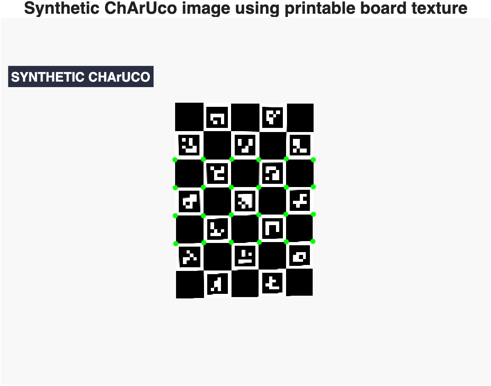
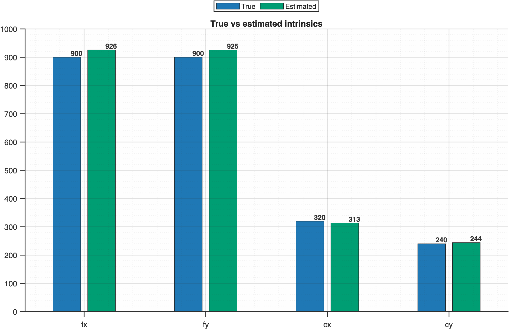
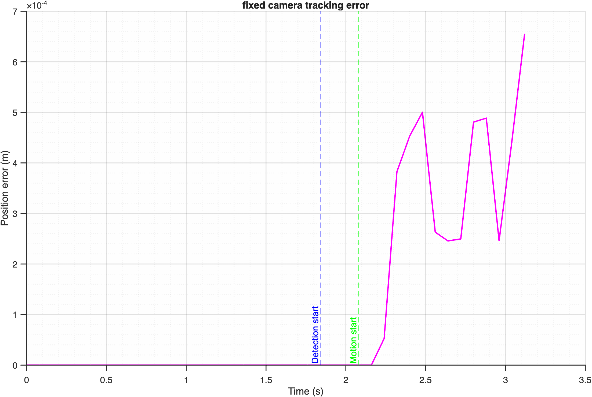
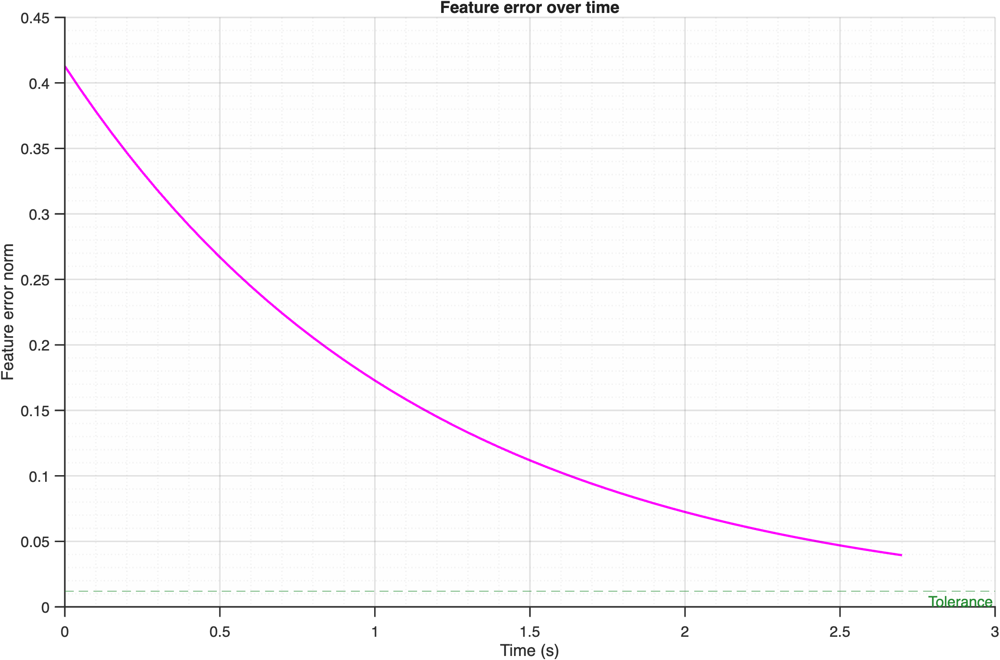

# Vision Tracking Demo

This repository contains a MATLAB implementation of a vision-based tracking demo built around a PUMA 560 model.

- source code in [`src/`](src/)
- tracked public assets in [`assets/`](assets/)
- simple analysis in [`results/`](results/)


## What It Does

- `T1`: ChArUco-based camera calibration
- `T2`: position-based tracking with fixed-camera and eye-in-hand simulation modes
- `T3`: feature-based tracking with an IBVS control loop
- real-camera follow and IBVS demos that reuse the saved calibration parameters

## Run

To run the simulation part, from the repository root in MATLAB:

```matlab
addpath(genpath(pwd));
results = run_demo();
```

To refresh the real-camera calibration parameters:

```matlab
addpath(genpath(pwd));
results = run_live_camera_calibration();
```

You can also use other tools, such as the MATLAB `Camera Calibrator` app, to generate the calibration parameters.

To run the real-camera follow or IBVS demos, prepare the printed ChArUco board before starting the real-camera demos; the current target feature is the calibration board.

```matlab
addpath(genpath(pwd));
follow = run_real_camera_follow();
ibvs = run_real_camera_ibvs();
```

To manually control with Start/Stop:

```matlab
follow = run_real_camera_follow('RunMode', 'manual');
ibvs = run_real_camera_ibvs('RunMode', 'manual');
```

## Results

Key numeric summaries are recorded in:
- [`results/analysis_summary.md`](results/analysis_summary.md)

Public, simulation-only figures are included for quick orientation:

### Calibration





### Tracking





The printable ChArUco board is also tracked for convenience:

- PNG: [`assets/charuco_board_printable.png`](assets/charuco_board_printable.png)
- PDF: [`assets/charuco_board_printable.pdf`](assets/charuco_board_printable.pdf)

Board parameters:

- pattern: `7 x 5`
- dictionary: `DICT_4X4_1000`
- checker size: `30 mm`
- marker size: `22.5 mm`
- image size: `2942 x 2102`

To regenerate or modify the board:

- edit `cfg.calibration.charuco` and `cfg.realCamera.charuco` in [`src/config.m`](src/config.m)
- keep those two sections aligned so the simulation and real-camera paths use the same board
- run `run_charuco_board_asset()` to refresh the printable PNG/PDF in `assets/`
- run `run_live_camera_calibration()` if you also want to refresh the saved camera parameters

Per-run text logs are generated locally under `results/` and are intentionally excluded from version control. The PNG/MP4/PDF outputs are also generated locally only.

## Notes

- The same printed ChArUco board is used for both the simulated and live-camera calibration flows.
- The tracked calibration file is [`assets/cameraParams.mat`](assets/cameraParams.mat), and the live-camera demos load it first when present.
