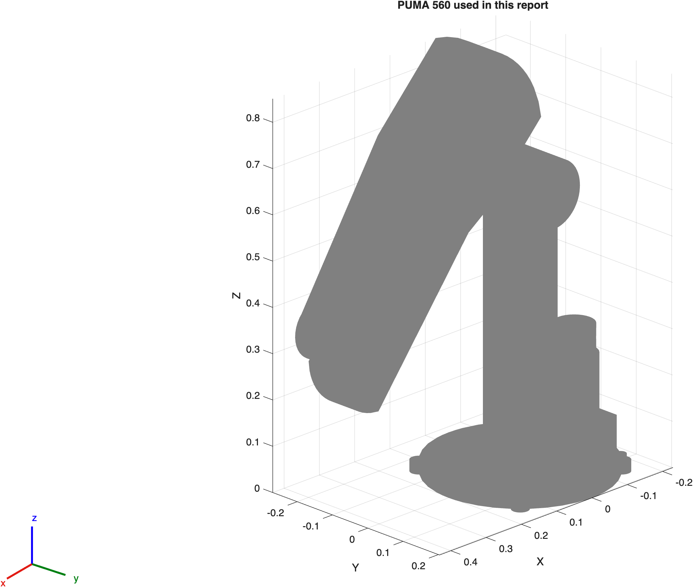
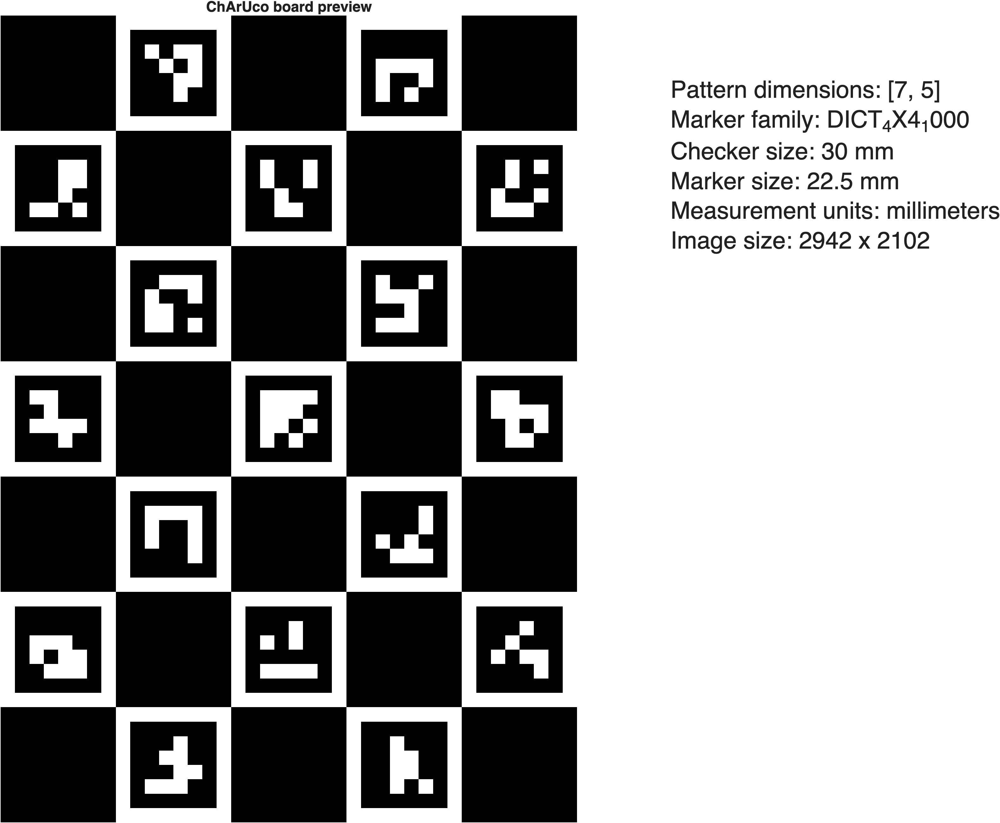
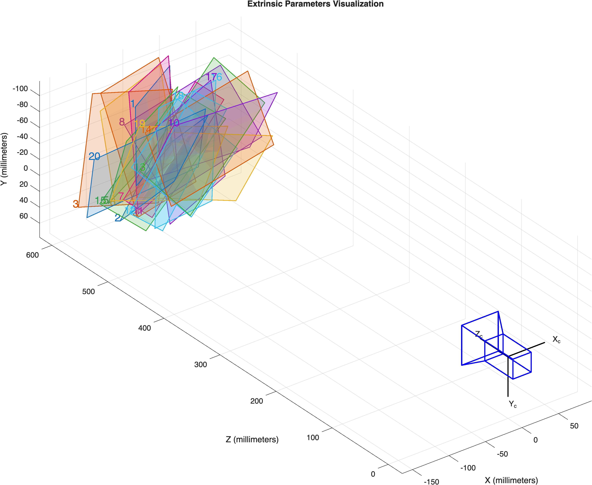
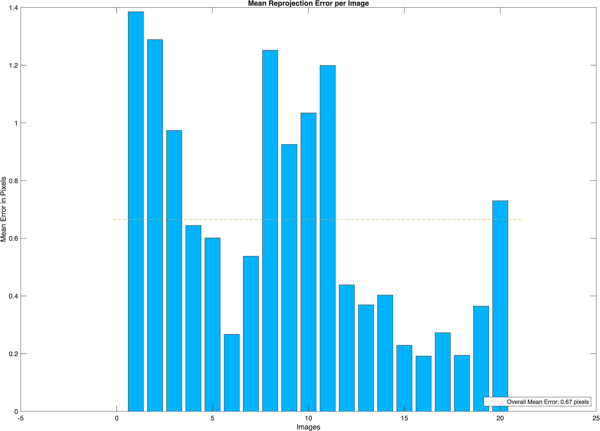

# 视觉伺服与机器人跟踪技术报告

## 摘要

课程项目 Part II 研究了三类视觉任务：相机标定、基于位置的目标跟踪、基于图像特征的视觉伺服。系统以 PUMA 560 为机械臂模型，分别实现了纯仿真和真实摄像头两条路径。仿真部分用于验证几何关系、控制律和收敛性；真实摄像头部分使用 MacBook 内置摄像头采集打印的 ChArUco 板，完成真实图像输入到虚拟机械臂控制的闭环。

## 1. 任务定义

`T1` 解决相机标定问题，建立图像坐标与世界坐标之间的映射。

`T2` 解决基于位置的跟踪问题，检测目标位置并驱动虚拟机械臂跟随。

`T3` 解决基于图像特征的视觉伺服问题，以四角点为特征实现 IBVS。

系统包含两条验证路径：

- 纯仿真：相机、目标和机械臂均在 MATLAB 内部模拟。
- 真实摄像头：MacBook 内置摄像头采集真实图像，机械臂仍由 MATLAB 虚拟模型承担。

## 2. 原理

### 2.1 针孔相机模型

相机模型采用针孔投影。世界点 \(\mathbf{X}_w\) 经过外参变换得到相机坐标 \(\mathbf{X}_c\)，再通过内参投影到像素平面：

\[
\mathbf{X}_c = \mathbf{R}\mathbf{X}_w + \mathbf{t},
\qquad
u = f_x \frac{X_c}{Z_c} + c_x,
\qquad
v = f_y \frac{Y_c}{Z_c} + c_y.
\]

相关实现位于 [`src/project_points.m`](src/project_points.m) 与 [`src/backproject_to_plane.m`](src/backproject_to_plane.m)。

### 2.2 Visual Servo

视觉伺服以图像测量量作为反馈量，实时更新机器人控制输入。控制循环由图像误差、几何映射和机械臂逆运动学共同构成。

### 2.3 PBVS

PBVS（Position-Based Visual Servoing）先估计目标在三维空间中的位姿，再根据位姿误差控制机器人。该方法在空间解释上更直接，适合位置跟踪类任务。

### 2.4 IBVS

IBVS（Image-Based Visual Servoing）直接在图像特征上定义误差。经典形式为：

\[
\mathbf{v} = -\lambda \mathbf{L}_s^+(\mathbf{s} - \mathbf{s}^\*)
\]

其中 \(\mathbf{s}\) 为当前特征，\(\mathbf{s}^\*\) 为期望特征，\(\mathbf{L}_s\) 为 interaction matrix / image Jacobian，\(\lambda\) 为控制增益。  
`T3` 采用这一框架，并用阻尼最小二乘保持数值稳定。

## 3. 系统结构与代码映射

MATLAB 版代码集中在 `src/`。

| 功能 | 文件 | 作用 |
|---|---|---|
| 主入口 | [`src/run_demo.m`](src/run_demo.m), [`src/main.m`](src/main.m) | 顺序运行 T1/T2/T3 并写日志 |
| 全局参数 | [`src/config.m`](src/config.m) | 统一定义相机、机器人、板子、路径、阈值 |
| 标定板资产 | [`src/charuco_board_asset.m`](src/charuco_board_asset.m) | 生成 ChArUco PNG/PDF |
| 真实标定 | [`src/live_camera_calibration.m`](src/live_camera_calibration.m), [`src/calibrate_charuco_images.m`](src/calibrate_charuco_images.m) | 采集真实图像并估计相机参数 |
| 参数加载 | [`src/load_camera_params.m`](src/load_camera_params.m) | 优先加载 `assets/cameraParams.mat` |
| T1 仿真 | [`src/t1_virtual_calibration.m`](src/t1_virtual_calibration.m) | 合成标定、输出图和视频 |
| T2 仿真 | [`src/t2_position_tracking.m`](src/t2_position_tracking.m) | fixed-camera 和 eye-in-hand 位置跟踪 |
| T3 仿真 | [`src/t3_ibvs_square.m`](src/t3_ibvs_square.m) | 方形目标 IBVS |
| 真实相机跟踪 | [`src/real_camera_tracking.m`](src/real_camera_tracking.m) | 真实摄像头驱动虚拟机械臂 |
| 几何与投影 | [`src/lookat_tform.m`](src/lookat_tform.m), [`src/project_points.m`](src/project_points.m), [`src/backproject_to_plane.m`](src/backproject_to_plane.m) | 相机姿态、投影、平面反投影 |
| 控制与数值稳定 | [`src/dls_solve.m`](src/dls_solve.m), [`src/session_controls.m`](src/session_controls.m) | 阻尼最小二乘、Start/Stop 会话控制 |
| 结果汇总 | [`assets/report/analysis_summary.md`](assets/report/analysis_summary.md) | 数值摘要 |

机器人模型由 [`src/config.m`](src/config.m) 中的 `loadrobot('puma560')` 创建。

  

该图为项目中实际使用的 PUMA 560 模型。T2/T3 复用同一 rigid body tree。

## 4. 标定板与相机参数

打印板和真实相机参数均存放在 `assets/report/` 下。

### 4.1 标定板

- [`assets/report/charuco_board_printable.png`](assets/report/charuco_board_printable.png)
- [`assets/report/charuco_board_printable.pdf`](assets/report/charuco_board_printable.pdf)

参数：

- pattern: `7 x 5`
- dictionary: `DICT_4X4_1000`
- checker size: `30 mm`
- marker size: `22.5 mm`
- image size: `2942 x 2102`

### 4.2 相机参数

- [`assets/report/cameraParams.mat`](assets/report/cameraParams.mat)

## 5. T1：相机标定与几何对齐

### 5.1 纯仿真标定

仿真标定由 [`src/t1_virtual_calibration.m`](src/t1_virtual_calibration.m) 完成。流程如下：

1. 生成 ChArUco 板纹理。
2. 设定 24 个相机视角。
3. 投影角点并加入噪声。
4. 使用 `estimateCameraParameters` 估计内参。
5. 统计重投影误差。

<table>
  <tr>
    <td align="center"></td>
    <td align="center"></td>
  </tr>
</table>

左图为相机在标定板周围的采样轨迹。红色轨迹表示视点变化，灰色连线指向板中心。右图为 printable ChArUco 纹理经透视投影后得到的合成图像。

该图比较真值与估计值。`fx/fy` 接近，`cx/cy` 存在轻微偏差，误差量级与采样噪声一致。

[T1 calibration animation MP4](assets/report/t1_calibration_animation.mp4)

视频展示采样视角变化、合成图像与标定板空间位置的对应关系。

### 5.2 真实相机标定

真实标定由 [`src/live_camera_calibration.m`](src/live_camera_calibration.m) 与 [`src/calibrate_charuco_images.m`](src/calibrate_charuco_images.m) 完成。流程如下：

1. 打印 ChArUco 板并保持平整。
2. 用 MacBook 内置摄像头采集图像。
3. 检测每帧中的 ChArUco 角点。
4. 估计 `cameraParams`。
5. 保存 `cameraParams.mat` 供 T2/T3 使用。

<table>
  <tr>
    <td align="center"></td>
    <td align="center"></td>
  </tr>
  <tr>
    <td align="center"></td>
    <td align="center"></td>
  </tr>
</table>

`real_camera_calibration_record.png` 记录标定采集过程。图中绿色点为检测到的 ChArUco 角点，角点覆盖范围决定了标定约束的稳定性。  
`real_camera_board_settings.png` 记录 MATLAB 标定板参数设置，包括板型、棋盘格尺寸、marker 尺寸、字典类型和测量单位。  
`real_camera_camera_centric.png` 给出 camera-centric extrinsics 视图，蓝色相机位姿与每帧板位姿分布在同一三维坐标系中。  
`real_camera_reprojection_errors.png` 给出逐帧重投影误差，柱状条高度对应每张标定图像的平均误差。

真实标定日志记录如下：

- 摄像头：`MacBook Pro Camera`
- 通过帧数：`24`
- 平均重投影误差：`4.1257 px`
- 估计 `fx/fy`：`1364.55 / 1357.13`

原始采集图像保存在 [`assets/report/live_camera_captures.png`](assets/report/live_camera_captures.png)，相机参数曲线见 [`assets/report/live_camera_intrinsics.png`](assets/report/live_camera_intrinsics.png)，采集进度和误差统计见 [`assets/report/live_camera_support.png`](assets/report/live_camera_support.png)。

## 6. T2：基于位置的跟踪

### 6.1 任务定义

T2 的目标是估计目标位置，并将位置误差反馈给虚拟机械臂，使末端持续跟随并保持悬停高度。

### 6.2 纯仿真 fixed-camera

纯仿真 fixed-camera 由 [`src/t2_position_tracking.m`](src/t2_position_tracking.m) 完成。实现流程为：

- 固定相机观察桌面。
- 桌面上设置红色目标球和三个干扰球。
- 通过颜色分割识别目标。
- 用 [`src/backproject_to_plane.m`](src/backproject_to_plane.m) 将图像中心点反投影到桌面平面。
- 用逆运动学控制 PUMA 560 末端保持在目标上方。

轨迹图给出目标、估计值与末端轨迹。图中的静止段和运动段分开显示，末端轨迹与目标轨迹保持一致。

误差图显示位置误差随时间下降并保持在较低水平。检测起点和运动起点标出了跟踪开始与目标运动开始的时刻。

关节图显示末端跟随过程中的关节联动。曲线连续，未出现明显跳变。

支持图左轴为检测到的 blob 面积，右轴为末端到目标的距离。两条曲线同时稳定时，跟踪链路保持有效。

[T2 fixed-camera MP4](assets/report/t2_fixed_camera_tracking.mp4)

仿真结果：

- final position error: `0.000198 m`
- RMSE position error: `0.000294 m`

### 6.3 纯仿真 eye-in-hand

eye-in-hand 版本同样由 [`src/t2_position_tracking.m`](src/t2_position_tracking.m) 完成，相机位于末端附近，视角随机器人变化。

轨迹图显示相机随机器人运动时，目标、命令与末端仍保持一致的跟随关系。

误差图显示末端到目标的平面距离收敛到毫米级。

关节图显示 eye-in-hand 布局下的关节协调。

支持图记录 blob 面积与末端-目标距离，反映相机随机器人运动时的检测和跟踪状态。

[T2 eye-in-hand MP4](assets/report/t2_eye_in_hand_tracking.mp4)

仿真结果：

- final position error: `0.000347 m`
- RMSE position error: `0.000441 m`

### 6.4 真实相机 follow

真实相机 follow 由 [`src/real_camera_tracking.m`](src/real_camera_tracking.m) 完成。流程如下：

- 真实摄像头采集图像。
- 读取 `cameraParams.mat`。
- 以打印的 ChArUco 板作为目标物。
- 从真实图像中估计目标位置。
- 用估计结果驱动虚拟 PUMA 560。

最新日志：

- 模式：`follow`
- 运行方式：`manual`
- 来源：`webcam`
- 处理样本：`32`

轨迹图把目标、命令点和末端轨迹放在同一 XY 平面和时间轴上。

误差图为 follow 模式的主指标，反映真实图像测量对应的空间误差。

关节图显示真实视觉输入下的关节响应。

支持图上半部分为检测框面积与可见性，下半部分为逐帧重投影误差。前者反映目标是否持续可见，后者反映位姿估计质量。

[Real follow MP4](assets/report/real_camera_follow_tracking.mp4)

### 6.5 T2 结果说明

仿真 fixed-camera、仿真 eye-in-hand 和真实 follow 三条路径都完成了位置闭环。三者共享同一套目标定义和几何关系，区别在于相机布局和输入来源。

## 7. T3：基于特征的跟踪 / IBVS

### 7.1 任务定义

T3 采用四角点特征构造 IBVS 闭环。目标为方形平面物体，控制量直接由图像特征误差和 interaction matrix 计算得到。

### 7.2 纯仿真 IBVS

仿真 IBVS 由 [`src/t3_ibvs_square.m`](src/t3_ibvs_square.m) 完成。实现流程如下：

1. 构造方形平面目标。
2. 计算当前四角点的归一化图像坐标。
3. 与期望特征作差，得到图像误差。
4. 根据 interaction matrix 构造控制律。
5. 使用 [`src/dls_solve.m`](src/dls_solve.m) 做阻尼最小二乘求解。
6. 使用回溯步长筛选稳定更新。

误差图记录图像特征误差随时间的变化。误差在迭代过程中下降到较低水平。

特征图显示当前归一化特征与期望特征的收敛过程。

深度图显示四个角点深度的变化。深度保持在可控范围内，便于解释 IBVS 的数值行为。

关节图显示特征伺服对应的关节响应。

[T3 IBVS MP4](assets/report/t3_ibvs_square_tracking.mp4)

仿真结果：

- final feature error: `0.013326`
- RMSE feature error: `0.159721`

### 7.3 真实相机 IBVS

真实相机 IBVS 同样通过 [`src/real_camera_tracking.m`](src/real_camera_tracking.m) 实现，运行模式切换为 `ibvs`。流程如下：

- 真实摄像头采集图像。
- 用 ChArUco 板角点构造特征。
- 由图像误差驱动虚拟机械臂。

最新日志：

- 模式：`ibvs`
- 运行方式：`auto`
- 来源：`webcam`
- 处理样本：`24`

误差图记录每帧图像特征误差的收敛过程。

特征图同时显示当前特征与期望特征。

关节图显示视觉伺服对应的关节响应。

支持图记录每帧是否成功检测到目标，并在标题中给出虚拟相机最终位置。

[Real IBVS MP4](assets/report/real_camera_ibvs_tracking.mp4)

### 7.4 T3 结果说明

T3 以图像特征误差为反馈量。图像平面上的角点布局逐步接近期望布局，虚拟相机位置也收敛到目标附近。

## 8. 结果统计

最新数值汇总保存在 [`assets/report/analysis_summary.md`](assets/report/analysis_summary.md)。

| 任务 | 指标 | 数值 |
|---|---:|---:|
| T1 仿真标定 | Mean reprojection error | `0.4226 px` |
| T1 仿真标定 | true `fx/fy` | `900.00 / 900.00` |
| T1 仿真标定 | estimated `fx/fy` | `938.22 / 940.26` |
| T1 真实标定 | Mean reprojection error | `4.1257 px` |
| T1 真实标定 | Accepted frames | `24` |
| T1 真实标定 | estimated `fx/fy` | `1364.55 / 1357.13` |
| T2 fixed 仿真 | Final position error | `0.000198 m` |
| T2 fixed 仿真 | RMSE position error | `0.000294 m` |
| T2 eye 仿真 | Final position error | `0.000347 m` |
| T2 eye 仿真 | RMSE position error | `0.000441 m` |
| T2 真实 follow | Processed samples | `32` |
| T3 仿真 IBVS | Final feature error | `0.013326` |
| T3 仿真 IBVS | RMSE feature error | `0.159721` |
| T3 真实 IBVS | Processed samples | `24` |

## 9. 结论

项目完成了相机标定、位置基跟踪和基于特征的视觉伺服三类任务。纯仿真部分验证了控制律与几何关系，真实摄像头部分验证了图像测量、相机参数和虚拟机械臂控制的联动。打印的 ChArUco 板与 `cameraParams.mat` 作为公共资产被复用到所有真实摄像头任务中。

## 10. 参考资料

1. Chaumette, F., & Hutchinson, S. *Visual Servo Control, Part I: Basic Approaches*; *Part II: Advanced Approaches*.
2. OpenCV official documentation: ChArUco calibration tutorial.
3. MathWorks documentation: `generateCharucoBoard`, `estimateCameraParameters`, `Camera Calibrator` app, `loadrobot('puma560')`, `inverseKinematics`.
